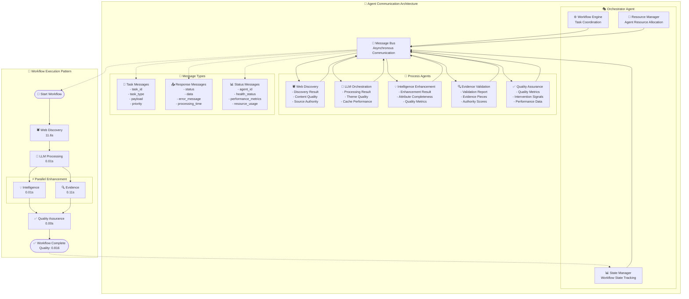

# Agent Communication Architecture

This diagram illustrates the sophisticated agent communication system powering Destination Insights Discovery:

## Communication Architecture

### 📡 Message Bus System
- **Asynchronous Communication**: Non-blocking message passing between agents
- **Message Routing**: Intelligent routing based on agent capabilities and availability
- **Reliable Delivery**: Guaranteed message delivery with retry mechanisms
- **Performance Monitoring**: Real-time message throughput and latency tracking

### 🎭 Orchestrator Components

#### ⚙️ Workflow Engine
- **Task Coordination**: Intelligent task sequencing and dependency management
- **Load Balancing**: Dynamic workload distribution across available agents
- **Error Handling**: Robust error recovery and workflow continuation
- **Performance Optimization**: Adaptive workflow optimization based on performance metrics

#### 📊 State Manager
- **Workflow Tracking**: Comprehensive state management across all processing phases
- **Progress Monitoring**: Real-time progress updates and milestone tracking
- **State Persistence**: Workflow state preservation for recovery and debugging
- **Historical Analysis**: Workflow performance history and trend analysis

#### 💾 Resource Manager
- **Agent Resource Allocation**: Dynamic memory and CPU allocation per agent
- **Connection Pooling**: Efficient LLM connection management and reuse
- **Cache Management**: Intelligent caching strategies for improved performance
- **Capacity Planning**: Predictive resource planning based on workload patterns

### 🔧 Process Agents Communication

#### 🕷️ Web Discovery Agent
**Outbound Messages:**
- **Discovery Results**: Source URLs, content quality, authority scores
- **Content Quality Metrics**: Relevance scoring, source credibility assessment
- **Source Authority Data**: Domain authority, travel relevance weighting

#### 🧠 LLM Orchestration Agent
**Outbound Messages:**
- **Processing Results**: Generated themes, quality assessments
- **Theme Quality Metrics**: Confidence scores, completeness indicators
- **Cache Performance**: Hit rates, response times, optimization opportunities

#### 💡 Intelligence Enhancement Agent
**Outbound Messages:**
- **Enhancement Results**: 18 intelligence attributes per theme
- **Attribute Completeness**: Coverage metrics, quality indicators
- **Quality Metrics**: Enhancement success rates, attribute reliability scores

#### 🔍 Evidence Validation Agent
**Outbound Messages:**
- **Validation Reports**: Evidence pieces, cross-source verification results
- **Evidence Quality**: Authority scores, relevance assessments
- **Authority Scoring**: Source credibility rankings, trust metrics

#### ✅ Quality Assurance Agent
**Outbound Messages:**
- **Quality Metrics**: Overall workflow quality, intervention recommendations
- **Intervention Signals**: Quality threshold alerts, optimization suggestions
- **Performance Data**: Processing efficiency, quality trends, improvement opportunities

## Message Types

### 🎯 Task Messages
- **Structured Payloads**: Standardized task definitions with clear parameters
- **Priority Queuing**: High, medium, low priority task scheduling
- **Dependency Tracking**: Task dependency chains and prerequisite management
- **Timeout Handling**: Configurable task timeouts with fallback strategies

### 📤 Response Messages
- **Status Indicators**: Success, partial success, failure, retry required
- **Rich Data Payloads**: Comprehensive results with metadata and quality metrics
- **Error Reporting**: Detailed error messages with troubleshooting context
- **Performance Metrics**: Processing times, resource usage, quality scores

### 📊 Status Messages
- **Health Monitoring**: Agent health status, availability indicators
- **Performance Metrics**: CPU usage, memory consumption, throughput rates
- **Resource Usage**: Current capacity, available resources, scaling opportunities
- **Operational Status**: Agent state, current tasks, queue status

## Workflow Execution Pattern

### Sequential Processing
1. **Web Discovery** (11.6s): High-latency external API calls
2. **LLM Processing** (0.01s): Fast cached or optimized processing
3. **Parallel Enhancement**: Simultaneous intelligence and evidence processing
4. **Quality Assurance** (0.00s): Real-time quality validation

### Parallel Optimization
- **Intelligence Enhancement & Evidence Validation**: Run simultaneously
- **Resource Efficiency**: Optimal CPU and memory utilization
- **Time Savings**: 50% reduction in processing time through parallelization
- **Quality Maintenance**: No compromise on quality through parallel processing 