# Agent Workflow Sequence

```mermaid
sequenceDiagram
    participant User
    participant Main as 📱 main.py
    participant AIL as 🤖 Agent Integration Layer
    participant Orch as 🎭 Orchestrator Agent
    participant Web as 🕷️ Web Discovery
    participant LLM as 🧠 LLM Orchestration
    participant Intel as 💡 Intelligence Enhancement
    participant Evidence as 🔍 Evidence Validation
    participant QA as ✅ Quality Assurance
    participant Viewer as 🎨 Viewer Generator
    participant Dashboard as 📱 Dashboard

    User->>Main: python main.py
    Main->>AIL: Initialize Agent System
    AIL->>Orch: Create Orchestrator
    
    Note over Orch: Initialize all process agents
    Orch->>Web: Initialize Web Discovery Agent
    Orch->>LLM: Initialize LLM Orchestration Agent
    Orch->>Intel: Initialize Intelligence Enhancement Agent
    Orch->>Evidence: Initialize Evidence Validation Agent
    Orch->>QA: Initialize Quality Assurance Agent
    
    User->>Main: Process destinations
    Main->>AIL: process_destinations(25 destinations)
    AIL->>Orch: execute_workflow(destinations)
    
    loop For each destination
        Note over Orch: Phase 1: Web Discovery
        Orch->>Web: execute_discovery(destination)
        Web-->>Web: Generate intelligent queries
        Web-->>Web: Search travel authority sources
        Web-->>Web: Extract and validate content
        Web->>Orch: DiscoveryResult(9 sources, quality 0.828)
        
        Note over Orch: Phase 2: LLM Processing
        Orch->>LLM: execute_llm_pipeline(content)
        LLM-->>LLM: Resource allocation (medium pool)
        LLM-->>LLM: 4-phase prompt processing
        LLM->>Orch: LLMResult(23 themes, quality 0.858)
        
        Note over Orch: Phase 3: Parallel Enhancement
        par Intelligence Enhancement
            Orch->>Intel: enhance_themes(themes)
            Intel-->>Intel: Process 18 intelligence attributes
            Intel-->>Intel: Generate composition analysis
            Intel->>Orch: EnhancementResult(enhanced themes)
        and Evidence Validation
            Orch->>Evidence: validate_evidence(themes, sources)
            Evidence-->>Evidence: Cross-source validation
            Evidence-->>Evidence: Authority scoring
            Evidence->>Orch: ValidationResult(38 evidence pieces)
        end
        
        Note over Orch: Phase 4: Quality Assurance
        Orch->>QA: continuous_monitoring(workflow_state)
        QA-->>QA: Quality assessment
        QA->>Orch: QualityMetrics(0.816)
        
        Orch->>AIL: WorkflowResult(success, quality 0.816)
    end
    
    AIL->>AIL: Convert to dashboard format
    AIL->>Viewer: generate_dashboard(results)
    Viewer-->>Viewer: Create HTML with back buttons
    Viewer-->>Viewer: Evidence modal integration
    Viewer->>Dashboard: Enhanced dashboard with 25 destinations
    
    Dashboard-->>User: 🎉 Destination Insights Discovery Ready!
```

This sequence diagram illustrates the detailed agent workflow process:

## Workflow Phases

### 🚀 Initialization Phase
- **Agent System Setup**: All 6 agents initialized and ready
- **Orchestrator Coordination**: Centralized command and control
- **Resource Allocation**: Intelligent resource management setup

### 🔄 Processing Loop (Per Destination)

#### Phase 1: Web Discovery (~11.6s)
- **Intelligent Query Generation**: Context-aware search optimization
- **Authority Source Search**: Government tourism sites, Lonely Planet, major travel authorities
- **Content Validation**: Quality filtering and relevance scoring
- **Result**: 9 high-quality sources with average quality 0.828

#### Phase 2: LLM Processing (~0.01s)
- **Resource Allocation**: Medium connection pool deployment
- **4-Phase Prompt Processing**: Discovery → Analysis → Enhancement → Assessment
- **Theme Generation**: 23 comprehensive themes per destination
- **Result**: High-quality theme analysis with quality score 0.858

#### Phase 3: Parallel Enhancement
**Intelligence Enhancement (~0.01s)**
- **18 Attribute Processing**: Core intelligence (14) + Content intelligence (4)
- **Composition Analysis**: Theme distribution and diversity metrics
- **Quality Optimization**: Continuous improvement mechanisms

**Evidence Validation (~0.11s)**
- **Cross-Source Verification**: Multi-authority evidence validation
- **Authority Scoring**: Source credibility and relevance weighting
- **Evidence Synthesis**: 38 evidence pieces across themes

#### Phase 4: Quality Assurance (~0.00s)
- **Continuous Monitoring**: Real-time quality assessment
- **Performance Analytics**: Comprehensive metrics collection
- **Quality Score**: Final quality assessment (average 0.816)

### 📊 Dashboard Generation
- **Format Conversion**: Agent results to dashboard format
- **UI Enhancement**: Back navigation and evidence modals
- **Professional Styling**: Modern, responsive design
- **Final Output**: Complete interactive dashboard ready for users 