# System Architecture Overview

```mermaid
graph TB
    User[👤 User] --> Main[🚀 main.py]
    User --> Server[🌐 start_server.py]
    
    Main --> AIL[🤖 Agent Integration Layer]
    AIL --> Mode{Agent System<br/>Available?}
    
    Mode -->|Yes| AgentFlow[Agent Workflow]
    Mode -->|No| LegacyFlow[Legacy Processing]
    Mode -->|Fallback| LegacyFlow
    
    subgraph AgentSystem["🤖 Agent Orchestration System"]
        Orchestrator[🎭 Orchestrator Agent<br/>Central Command & Coordination]
        
        subgraph Agents["Processing Agents"]
            WebAgent[🕷️ Web Discovery Agent<br/>Smart Content Discovery]
            LLMAgent[🧠 LLM Orchestration Agent<br/>Resource Management]
            IntelAgent[💡 Intelligence Enhancement<br/>18 Attribute Processing]
            EvidenceAgent[🔍 Evidence Validation<br/>Cross-Source Verification]
            QAAgent[✅ Quality Assurance<br/>Continuous Monitoring]
        end
        
        Orchestrator --> WebAgent
        Orchestrator --> LLMAgent
        Orchestrator --> IntelAgent
        Orchestrator --> EvidenceAgent
        Orchestrator --> QAAgent
        
        WebAgent --> LLMAgent
        LLMAgent --> IntelAgent
        IntelAgent --> EvidenceAgent
        EvidenceAgent --> QAAgent
    end
    
    AgentFlow --> Orchestrator
    
    subgraph LegacySystem["🔧 Legacy Processing System"]
        WebDiscovery[🌐 Web Discovery Tools]
        PromptProcessor[🎯 Focused Prompt Processor]
        DataProcessor[📊 Enhanced Data Processor]
        Validator[✅ Evidence Validator]
    end
    
    LegacyFlow --> WebDiscovery
    WebDiscovery --> PromptProcessor
    PromptProcessor --> DataProcessor
    DataProcessor --> Validator
    
    AgentFlow --> Results[📊 Processing Results]
    LegacyFlow --> Results
    
    Results --> ViewerGen[🎨 Enhanced Viewer Generator]
    ViewerGen --> Dashboard[📱 Interactive Dashboard]
    ViewerGen --> DevStaging[🔧 Development Staging]
    
    Server --> DevStaging
    Dashboard --> Browser[🌐 Web Browser]
    
    subgraph ExternalAPIs["🌍 External APIs"]
        Gemini[🤖 Gemini 2.0 Flash]
        OpenAI[🧠 OpenAI o4-mini]
        JinaReader[📖 Jina Reader API]
        SearchEngines[🔍 Search Engines]
    end
    
    WebAgent -.-> JinaReader
    WebAgent -.-> SearchEngines
    LLMAgent -.-> Gemini
    LLMAgent -.-> OpenAI
    WebDiscovery -.-> JinaReader
    PromptProcessor -.-> Gemini
```

This diagram shows the high-level architecture of the Destination Insights Discovery system, including:

## Key Components

### 🤖 Agent Orchestration System
- **Orchestrator Agent**: Central command and coordination
- **Processing Agents**: 5 specialized agents working in harmony
- **Intelligent Workflow**: Sequential and parallel processing with dependencies

### 🔧 Legacy Processing System  
- **Backward Compatibility**: Fallback system when agents unavailable
- **Proven Reliability**: Battle-tested processing pipeline
- **Seamless Integration**: Transparent switching between modes

### 🌍 External Integrations
- **Multiple LLM Providers**: Gemini 2.0 Flash and OpenAI o4-mini
- **Web Discovery APIs**: Jina Reader and search engines
- **Intelligent Fallbacks**: Graceful degradation when APIs unavailable

### 📱 Dashboard Generation
- **Professional UI**: Modern, responsive dashboard
- **Evidence Integration**: Real web URLs with authority scoring
- **Development Staging**: Automatic staging for immediate access 