# Data Flow Architecture

```mermaid
graph LR
    subgraph Input["📥 Input Data"]
        Dest[🌍 25 Top Destinations<br/>Grand Canyon, Tokyo, Paris...]
        Config[⚙️ Configuration<br/>config.yaml, agent_config.yaml]
    end
    
    subgraph WebDiscovery["🕷️ Web Discovery Phase"]
        Queries[🔍 Intelligent Queries<br/>10 context-aware searches]
        Sources[🌐 Authority Sources<br/>Lonely Planet, TripAdvisor<br/>Government Tourism Sites]
        Content[📄 Raw Content<br/>9 high-quality sources<br/>Average quality: 0.828]
    end
    
    subgraph LLMProcessing["🧠 LLM Processing Phase"]
        Phase1[📋 Theme Discovery<br/>5 parallel prompts]
        Phase2[🔍 Theme Analysis<br/>Sequential analysis]
        Phase3[✨ Content Enhancement<br/>Parallel enhancement]
        Phase4[🎯 Quality Assessment<br/>Sequential validation]
        Themes[🎨 Generated Themes<br/>23 themes per destination]
    end
    
    subgraph IntelligenceEnhancement["💡 Intelligence Enhancement"]
        CoreAttribs[🎯 Core Intelligence<br/>14 attributes per theme]
        ContentAttribs[📊 Content Intelligence<br/>4 specialized attributes]
        EnhancedThemes[✨ Enhanced Themes<br/>18 attributes per theme]
    end
    
    subgraph EvidenceValidation["🔍 Evidence Validation"]
        CrossValidation[🔄 Cross-Source Validation<br/>Multi-source verification]
        AuthorityScoring[🏆 Authority Scoring<br/>Source credibility assessment]
        EvidencePieces[📋 Evidence Pieces<br/>38 pieces across themes]
        ValidationReport[📊 Validation Report<br/>16 keys including theme_evidence]
    end
    
    subgraph Dashboard["📱 Interactive Dashboard"]
        ThemeCards[🎴 Professional Theme Cards<br/>Evidence paperclips]
        EvidenceModals[🔍 Evidence Modals<br/>Real web URLs, authority scores]
        BackNavigation[🔙 Back Navigation<br/>Return to main dashboard]
        QualityIndicators[📊 Quality Indicators<br/>Excellent/Good/Acceptable]
    end
    
    Dest --> Queries
    Config --> Queries
    Queries --> Sources
    Sources --> Content
    
    Content --> Phase1
    Phase1 --> Phase2
    Phase2 --> Phase3
    Phase3 --> Phase4
    Phase4 --> Themes
    
    Themes --> CoreAttribs
    Themes --> ContentAttribs
    CoreAttribs --> EnhancedThemes
    ContentAttribs --> EnhancedThemes
    
    EnhancedThemes --> CrossValidation
    Content --> CrossValidation
    CrossValidation --> AuthorityScoring
    AuthorityScoring --> EvidencePieces
    EvidencePieces --> ValidationReport
    
    EnhancedThemes --> ThemeCards
    ValidationReport --> EvidenceModals
    ThemeCards --> EvidenceModals
    EvidenceModals --> BackNavigation
    ValidationReport --> QualityIndicators
```

This data flow diagram illustrates how information transforms through the Destination Insights Discovery system:

## Data Transformation Pipeline

### 📥 Input Layer
- **25 Top Destinations**: Curated list of world's premier travel destinations
- **Configuration**: System behavior and agent parameters
- **Quality**: Pre-validated, high-potential destinations ready for analysis

### 🕷️ Web Discovery Layer
- **Query Intelligence**: 10 context-aware searches per destination
- **Authority Prioritization**: Government tourism sites, major travel authorities
- **Content Validation**: Quality scoring and relevance filtering
- **Output**: 9 authoritative sources with 0.828 average quality

### 🧠 LLM Processing Layer
- **4-Phase Decomposition**: Prevents truncation, ensures comprehensive analysis
- **Parallel Processing**: Optimized for speed and quality
- **Theme Generation**: 23 rich, detailed themes per destination
- **Quality Control**: Sequential validation ensures accuracy

### 💡 Intelligence Enhancement Layer
- **Core Intelligence (14 attributes)**: Price insights, seasonality, traveler types, accessibility, authenticity, hidden gems, cultural sensitivity, experience intensity, time commitment, transportation, accommodation, booking considerations, depth analysis, nano themes
- **Content Intelligence (4 attributes)**: Iconic landmarks, practical intelligence, neighborhood insights, content discovery metadata
- **Enhancement Result**: 18 comprehensive attributes per theme

### 🔍 Evidence Validation Layer
- **Cross-Source Verification**: Evidence validated across multiple authorities
- **Authority Scoring**: Source credibility weighting and relevance assessment
- **Evidence Synthesis**: 38 evidence pieces distributed across themes
- **Validation Report**: Comprehensive metadata including theme evidence, source authority, validation metrics

### 📱 Dashboard Layer
- **Professional Theme Cards**: Clean, modern design with evidence integration
- **Evidence Modals**: Interactive overlays with real web URLs and authority scores
- **Navigation System**: Seamless movement between destinations and main dashboard
- **Quality Visualization**: Clear indicators for evidence strength and theme completeness

## Data Quality Metrics

### Processing Efficiency
- **Web Discovery**: ~11.6 seconds per destination
- **LLM Processing**: ~0.01 seconds (cached)
- **Enhancement**: ~0.01 seconds per destination
- **Evidence Validation**: ~0.11 seconds per destination
- **Total**: ~12 seconds per destination

### Quality Distribution
- **Excellent Themes** (0.85+): Multi-source evidence, high authority scores
- **Good Themes** (0.70-0.84): Moderate evidence support, reliable sources
- **Acceptable Themes** (0.50-0.69): Basic analysis, limited evidence

### Evidence Coverage
- **52% of themes**: Real web evidence from authoritative sources
- **48% of themes**: AI-generated analysis with quality indicators
- **100% coverage**: All themes have either evidence or clear AI analysis markers 